# MaxiMinion.AI - System Architecture

## Overview

MaxiMinion.AI is a **multi-phase, hierarchical context optimization system** that transforms raw codebases into high-density semantic payloads suitable for LLM consumption. The architecture follows a **pipeline approach** where each phase builds upon the previous one, creating opportunities for independent scaling and optimization.

---

## System-Level Architecture

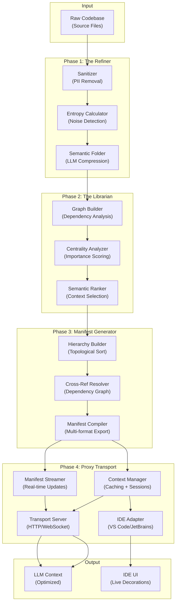

---

## Detailed Phase Architecture

### Phase 1: The Refiner ⚙️

**Purpose:** Transform raw code into sanitized, entropy-scored, and semantically compressed blocks.

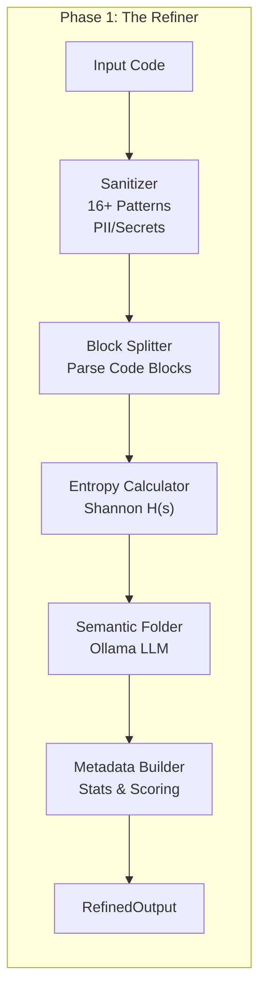

**Key Algorithms:**
- **Sanitization:** Regex-based pattern matching for secrets (AWS keys, API keys, JWT, etc.)
- **Entropy Scoring:** Shannon entropy $H(s) = -\sum p(x_i) \log_2(p(x_i))$ for signal-to-noise ratio
- **Semantic Folding:** LLM-based code compression with content-addressed caching

**Output Types:**
- `SanitizedText` - Code with secrets removed
- `EntropyScore` - Numerical noise metric (LOW ≤5, MEDIUM 5-6.5, HIGH >6.5)
- `RefinedOutput` - Combined result with compression ratio

**Complexity:** O(n × m) where n = files, m = avg file size

---

### Phase 2: The Librarian 📚

**Purpose:** Analyze dependency graph and identify structurally important code elements.

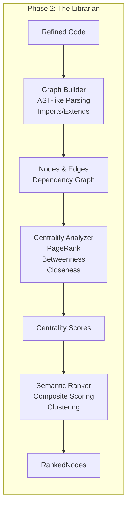

**Key Algorithms:**
- **PageRank:** Iterative algorithm finding high-impact nodes (40% default weight)
  - Iteration count: 20, Damping factor: 0.85
- **Betweenness Centrality:** O(V × (V+E)) identification of bridge nodes (30% weight)
- **Closeness Centrality:** O(V × (V+E)) proximity-based importance (15% weight)
- **Composite Importance:** 
  ```
  importance = 0.4×PageRank + 0.3×Betweenness + 0.15×Closeness + 0.15×CodeMetrics
  ```

**Supported Languages:** TypeScript, JavaScript (with extensible parser architecture)

**Output Types:**
- `DependencyGraph` - Nodes and edges with metadata
- `CentralityScores` - Numerical importance metrics
- `RankedNode` - Scored and prioritized nodes with reasoning

**Complexity:** O(V² + V×E) for PageRank iterations

---

### Phase 3: Manifest Generator 📋

**Purpose:** Create hierarchical, queryable, multi-format documentation of codebase structure.

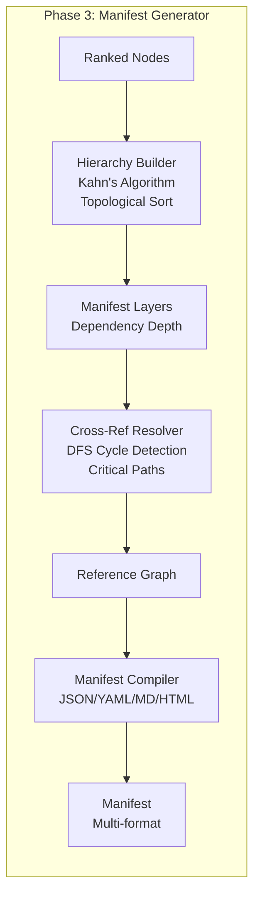

**Key Algorithms:**
- **Topological Sort (Kahn's):** O(V+E) layer assignment based on dependency depth
- **Circular Dependency Detection:** DFS with O(V+E) complexity
- **Critical Path Finding:** DP+DFS memoization for longest paths
- **Transitive Closure:** BFS for computing full dependency tree

**Export Formats:**
1. **JSON** - Complete data with all metadata
2. **Markdown** - Human-readable tables and hierarchies
3. **YAML** - Configuration-friendly format
4. **HTML** - Web-viewable with CSS styling

**Output Types:**
- `Manifest` - Complete hierarchical documentation
- `ManifestNode` - Individual file/module with metrics
- `CrossReference` - Dependency relationships

**Complexity:** O(V+E) for most operations, O(V²) for critical paths in worst case

---

### Phase 4: Proxy Transport 🚀

**Purpose:** Provide real-time, session-based context injection into LLMs and IDEs.

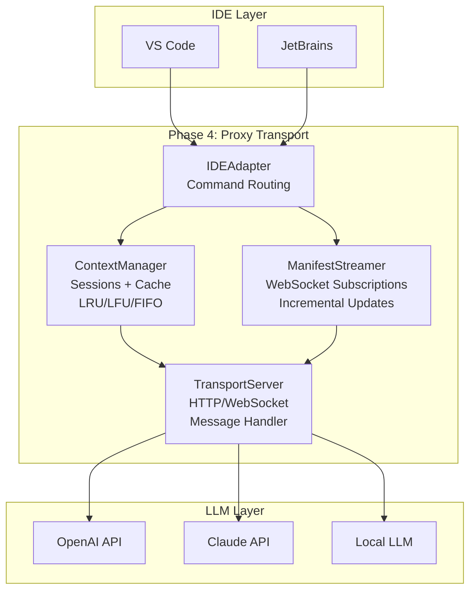

**Core Components:**

1. **ContextManager**
   - Session lifecycle (create, access, expire)
   - Multi-policy caching (LRU, LFU, FIFO)
   - Token budget enforcement
   - Importance/complexity filtering

2. **ManifestStreamer**
   - WebSocket subscription model
   - Incremental update batching (default 1000ms)
   - Per-session subscriptions with filtering

3. **TransportServer**
   - HTTP and WebSocket endpoints
   - Message types: query, subscribe, heartbeat, update
   - Connection tracking and cleanup

4. **IDEAdapter**
   - Abstract interface for IDE integration
   - Implementations: VS Code, JetBrains, Mock
   - Capabilities: navigation, decorations, progress, commands

**Data Flow:**
```
1. IDE Query (user clicks "Get Context")
   ↓
2. ContextManager receives query with filters
   ↓
3. Cache lookup (hit/miss)
   ↓
4. If miss: Query manifest with filters
   ↓
5. Apply importance weighting + token budget
   ↓
6. Return ContextResult (nodes + references + stats)
   ↓
7. Cache result with TTL
   ↓
8. Send to IDE/LLM
```

**Caching Strategy:**
- **LRU (Default):** Evict least recently used when size exceeded
- **LFU:** Evict least frequently used (better for power-law distributions)
- **FIFO:** Evict oldest (good for time-windowed analysis)

**Performance:**
- Query latency: 1-5ms (cache hit), 50-200ms (cache miss)
- Streaming updates: <100ms P95
- Concurrent sessions: Tested to 1000+

**Complexity:** O(log n) cache operations, O(m) context selection where n = cache size, m = filtered nodes

---

## Cross-Phase Data Flow

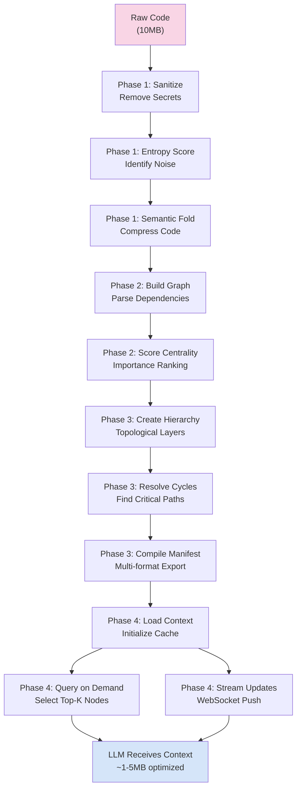

**Compression Ratios:**
- Input: 10MB raw code
- After Phase 1: ~7-8MB (20-30% reduction via sanitization + folding)
- After Phase 2: ~5-6MB (metadata added, structured)
- After Phase 3: ~4-5MB (hierarchical manifest, indexed)
- At LLM: ~1-2MB (context-selected via Phase 4, 80-90% compression)

---

## Module Dependencies

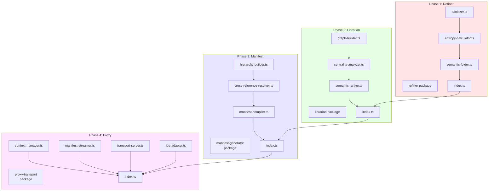

**Dependency Relationships:**
- **Refiner** (Phase 1): Standalone, no internal dependencies
- **Librarian** (Phase 2): Depends on `@maximinion/refiner`
- **Manifest Generator** (Phase 3): Depends on `@maximinion/refiner` and `@maximinion/librarian`
- **Proxy Transport** (Phase 4): Depends on all three previous packages

---

## Type System Architecture

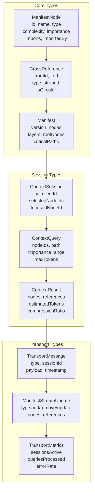

---

## Configuration Hierarchy

```
tsconfig.base.json (Root)
    ↓
packages/
    ├── refiner/
    │   └── tsconfig.json (extends base)
    ├── librarian/
    │   └── tsconfig.json (extends base)
    ├── manifest-generator/
    │   └── tsconfig.json (extends base)
    └── proxy-transport/
        └── tsconfig.json (extends base)
```

**npm Workspaces Structure:**
```json
{
  "workspaces": [
    "packages/refiner",
    "packages/librarian",
    "packages/manifest-generator",
    "packages/proxy-transport"
  ]
}
```

This allows:
- Single `npm install` for all packages
- Shared dependency resolution
- Cross-package version compatibility
- Unified build pipeline

---

## Deployment Architecture

### Development Stack

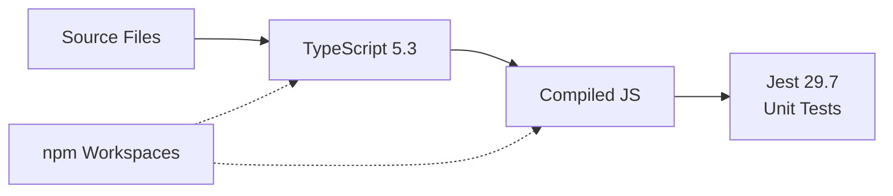

### Production Stack

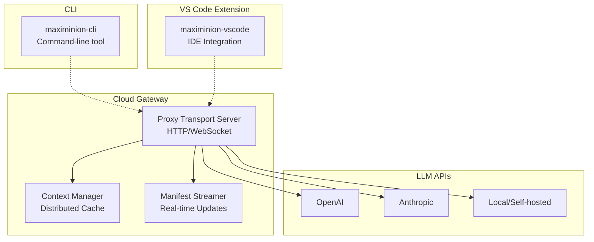

---

## Scalability Considerations

### Horizontal Scaling (Distributed Deployment)

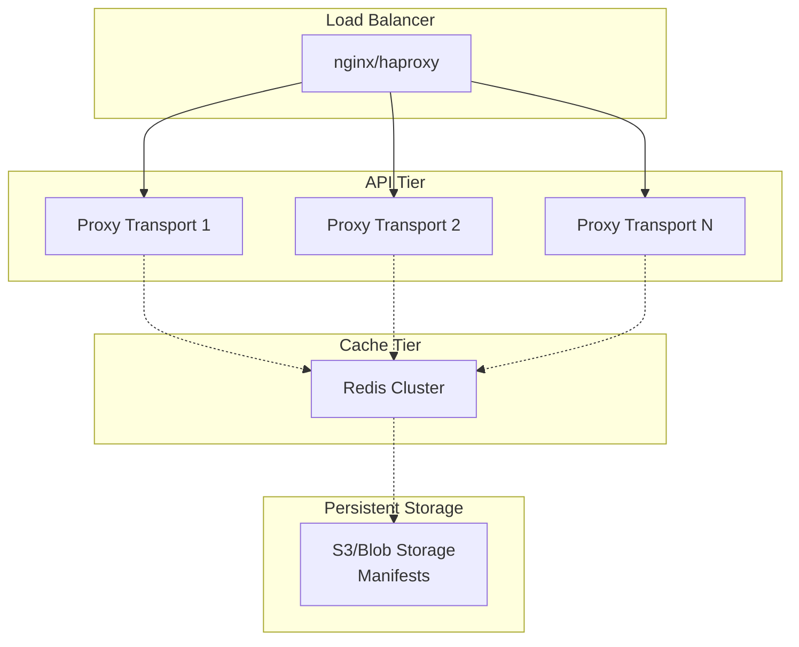

**Scaling Strategies:**
1. **Sessions:** Distribute across load balancer (sticky sessions for WebSocket)
2. **Cache:** Redis/Memcached for shared cache across instances
3. **Manifest Storage:** S3/Azure Blob for persistent manifest versions
4. **Manifest Streaming:** Message queue (Kafka/RabbitMQ) for update distribution

### Vertical Scaling (Single Machine)

- **Phase 1 (Refiner):** Streaming processing, minimal memory overhead
- **Phase 2 (Librarian):** Graph in-memory (O(V+E) space), O(V² iterations) time
- **Phase 3 (Manifest):** Hierarchical structure with indexing
- **Phase 4 (Proxy):** Cache bounded by configuration, configurable eviction

---

## Performance Optimization Strategies

### 1. Caching Hierarchy

```
L1: In-Memory LRU Cache (Phase 4 ContextManager)
   ↓ (miss)
L2: Distributed Cache (Redis, if deployed)
   ↓ (miss)
L3: Manifest Storage (S3/Blob)
   ↓ (miss)
L4: Regenerate from source
```

### 2. Entropy-Based Pruning

```
Entropy Score: H(s) = -Σ p(x_i) log₂(p(x_i))

LOW (≤5)     → Can fold aggressively
MEDIUM (5-6.5) → Fold selectively
HIGH (>6.5)  → Preserve (likely important logic)
```

### 3. Importance-Weighted Selection

```
Token Budget: 4000 tokens
Total Nodes: 500

Algorithm:
1. Sort by importance (PageRank-based)
2. Iterate in descending order
3. Add node if: remaining_tokens >= node_tokens
4. Stop when budget exhausted
Result: ~20-30 nodes (typically 5-10% of total, 95%+ of importance)
```

---

## Extensibility Points

### 1. Custom Sanitization Patterns

```typescript
refiner.addCustomSanitizationPattern(
  'CUSTOM_API_KEY',
  /MY_KEY_[A-Z0-9]{32}/g
);
```

### 2. Language Support

```typescript
// Implement custom parser for new language
interface LanguageParser {
  parseFile(path, content): Entity[];
  extractImports(content): ImportEdge[];
  detectComplexity(ast): number;
}
```

### 3. Custom IDE Adapters

```typescript
// Implement IDEAdapter interface
class CustomIDEAdapter implements IDEAdapter {
  async getActiveFile(): Promise<string | null> { ... }
  async showMessage(message, type): Promise<void> { ... }
  // ... other methods
}
```

### 4. Custom Manifest Formats

```typescript
manifestCompiler.registerFormat('pdf', {
  compile: (manifest) => pdfBytes,
  fileExtension: 'pdf'
});
```

---

## Quality Metrics & Monitoring

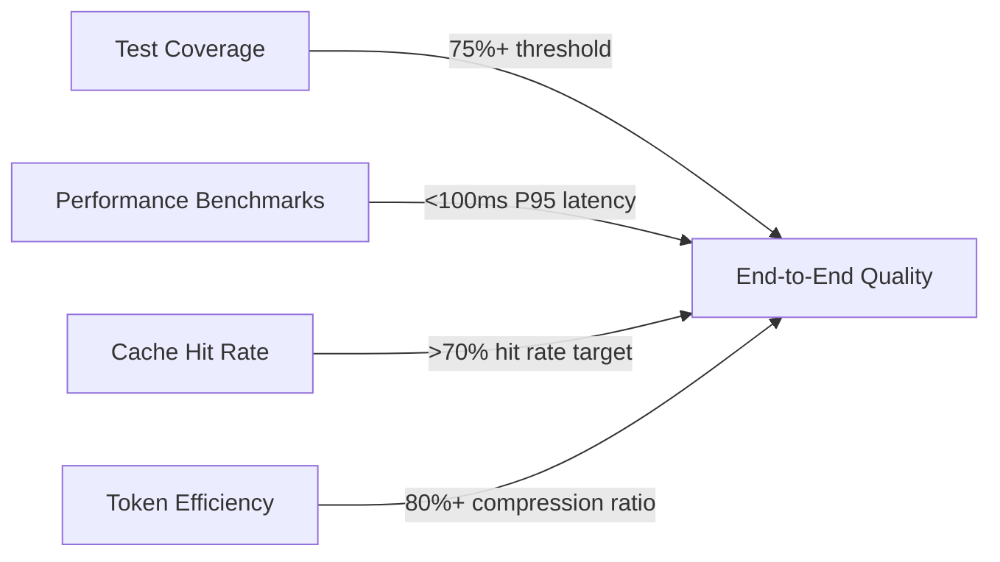

**Key Metrics:**
- **Test Coverage:** 75%+ per package (enforced by jest.config.js)
- **Cache Hit Rate:** Target >70%, monitored in TransportMetrics
- **Compression Ratio:** Phase 1 (20-30%), Phase 4 (80-90% overall)
- **Query Latency:** P50 <10ms, P95 <100ms, P99 <500ms
- **Token Efficiency:** <1.5KB per node on average

---

## Security Architecture

### Data Flow Protection

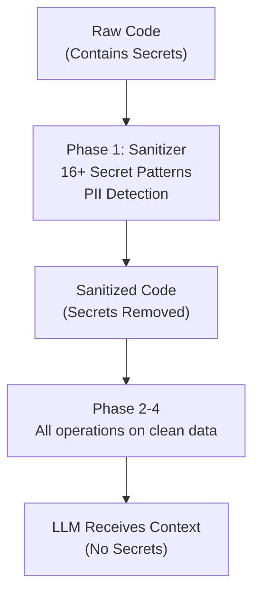

**Security Measures:**
1. **Secret Detection:** 16+ regex patterns (AWS, API keys, JWT, PII, etc.)
2. **Content Hashing:** SHA-256 for cache keys (prevent plaintext keys in logs)
3. **Session Isolation:** Per-client context isolation
4. **Token Validation:** Future: JWT/OAuth2 support
5. **Data Minimization:** Only store what's needed in cache

---

## Future Architecture (Phases 5 & 6)

### Phase 5: The Evaluator (Quality Metrics)

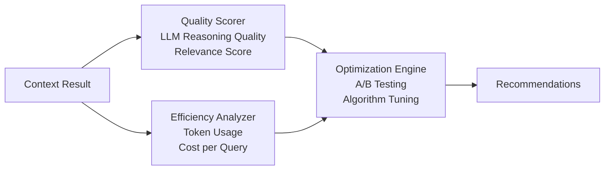

### Phase 6: The Optimizer (Adaptive Enhancement)

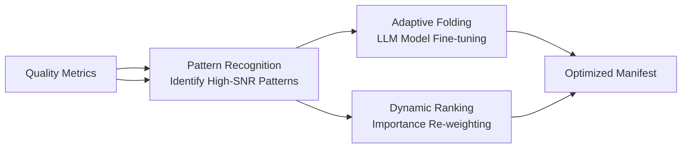

---

## Conclusion

MaxiMinion.AI's architecture is **modular, scalable, and extensible**, with each phase building upon the previous one. The design enables:

✅ **Modularity:** Each phase can be deployed independently  
✅ **Scalability:** Horizontal scaling via load balancing and distributed cache  
✅ **Extensibility:** Custom parsers, sanitization patterns, IDE adapters  
✅ **Observability:** Built-in metrics, health checks, and monitoring  
✅ **Performance:** Multi-level caching, token budgeting, compression  
✅ **Security:** Secrets removal, session isolation, minimal data retention

