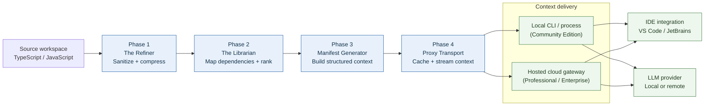

# MaxiMinion.AI - Documentation Index

Welcome to the MaxiMinion.AI documentation hub. This guide helps you navigate all available resources.

---

## 📖 Core Documentation

### 🚀 Getting Started
- **[README.md](../README.md)** - Project overview, problem statement, quick start
- **[CONTRIBUTING.md](../CONTRIBUTORS.md)** - How to contribute code, report bugs, write docs

### 🏗️ Architecture & Design
- **[ARCHITECTURE.md](../ARCHITECTURE.md)** - System design, component diagrams, data flow
- **[BUSINESS_MODEL.md](../BUSINESS_MODEL.md)** - Pricing strategy, versioning, deployment options

## 🗺️ Project Visual Architecture

This diagram shows the primary project flow from a source workspace to optimized context delivered locally or through the hosted gateway.



**Architecture at a glance:**

- The four phases form a composable pipeline; each phase can be used independently.
- Community deployments run locally with no hosted gateway dependency.
- Professional and Enterprise deployments can add the hosted gateway for shared sessions, distributed caching, and team access.
- Detailed component, data-flow, security, and scaling diagrams are available in [ARCHITECTURE.md](../ARCHITECTURE.md).

---

## 📋 Phase Documentation

### Phase 1: The Refiner ⚙️
[PHASE_1.md](PHASE_1.md)

**Purpose:** Sanitize code and compress via semantic folding

**Key Topics:**
- Sanitization (16+ secret patterns, PII removal)
- Entropy scoring (Shannon H(s), signal-to-noise ratio)
- Semantic folding (LLM-based compression)
- Token estimation
- Configuration & customization
- Performance benchmarks
- Troubleshooting

**Best for:**
- Understanding code sanitization
- Learning entropy-based noise detection
- Integrating Ollama for compression
- Custom secret pattern development

---

### Phase 2: The Librarian 📚
[PHASE_2.md](PHASE_2.md)

**Purpose:** Analyze codebase structure via graph theory and centrality scoring

**Key Topics:**
- Dependency graph building (AST-like parsing)
- Centrality algorithms (PageRank, Betweenness, Closeness)
- Semantic ranking & importance scoring
- Composite importance formula
- Cluster detection
- Critical path analysis
- Integration with Phase 1
- Performance & scalability
- Troubleshooting

**Best for:**
- Understanding code dependencies
- Learning graph theory algorithms
- Identifying key modules
- Analyzing codebase structure
- Integrating with Phase 1 pipeline

---

### Phase 3: Manifest Generator 📋
[PHASE_3.md](PHASE_3.md)

**Purpose:** Create hierarchical, queryable codebase documentation

**Key Topics:**
- Hierarchy building (topological sort)
- Cross-reference resolution (cycle detection, critical paths)
- Manifest compilation (JSON, Markdown, YAML, HTML)
- Multi-format export
- Query API & filtering
- Integration with Phases 1-2
- Data structures & types
- Performance benchmarks
- Troubleshooting

**Best for:**
- Understanding hierarchical organization
- Learning multi-format export
- Querying manifests
- Creating custom export formats
- Integrating Phases 1-3

---

### Phase 4: Proxy Transport 🚀
[PHASE_4.md](PHASE_4.md)

**Purpose:** Provide real-time context injection with IDE integration

**Key Topics:**
- Real-time context delivery
- Session & cache management (LRU/LFU/FIFO)
- WebSocket streaming
- IDE adapters (VS Code, JetBrains)
- HTTP/WebSocket protocol
- Context selection algorithms
- Token budgeting
- Performance metrics
- Deployment patterns
- Troubleshooting

**Best for:**
- Understanding IDE integration
- Learning caching strategies
- Real-time streaming protocols
- Building custom IDE adapters
- Deploying as proxy server

---

### Phase 5: The Evaluator (Future) 📊
*Coming in Year 2*

**Purpose:** Quality measurement and optimization

**Topics:**
- Context quality scoring
- Relevance metrics
- Token efficiency analysis
- A/B testing framework
- LLM reasoning quality evaluation
- Optimization recommendations

---

### Phase 6: The Optimizer (Future) 🔧
*Coming in Year 2*

**Purpose:** Adaptive model fine-tuning and enhancement

**Topics:**
- Pattern recognition from quality metrics
- Adaptive algorithm tuning
- Model fine-tuning (SFT/DPO)
- Dynamic importance re-weighting
- Custom LLM context optimization

---

## 🎯 By Use Case

### Use Case 1: "I want to clean up my code for LLM context"
1. Start: [README.md](../README.md) - Overview
2. Learn: [PHASE_1.md](PHASE_1.md) - Sanitization & entropy
3. Try: CLI tool - `npx @maximinion/refiner --input ./src`
4. Reference: [PHASE_1.md](PHASE_1.md#configuration) - Custom patterns

### Use Case 2: "I want to understand my codebase structure"
1. Start: [README.md](../README.md) - Overview
2. Learn: [PHASE_2.md](PHASE_2.md) - Graph analysis
3. Try: CLI tool - `npx @maximinion/librarian --input ./src`
4. Deep Dive: [ARCHITECTURE.md](../ARCHITECTURE.md#phase-2-the-librarian) - Algorithms
5. Reference: [PHASE_2.md](PHASE_2.md#centrality-algorithms) - API details

### Use Case 3: "I want to generate codebase documentation"
1. Start: [README.md](../README.md) - Overview
2. Learn: [PHASE_3.md](PHASE_3.md) - Manifest generation
3. Try: CLI tool - `npx @maximinion/manifest-generator --input ./src --format markdown`
4. Deep Dive: [PHASE_3.md](PHASE_3.md#multi-format-export) - Export formats
5. Reference: [PHASE_3.md](PHASE_3.md#export-formats) - Format-specific details

### Use Case 4: "I want to integrate context into my IDE"
1. Start: [README.md](../README.md) - Overview
2. Learn: [PHASE_4.md](PHASE_4.md) - Proxy transport foundations
3. Try: [VS Code sanitizer MVP](../packages/vscode-extension/README.md) - Build and install a local VSIX
4. Note: Marketplace publishing and live context injection are not available yet
5. Advanced: [ARCHITECTURE.md](../ARCHITECTURE.md#phase-4-proxy-transport) - Planned integration architecture

### Use Case 5: "I want to deploy MaxiMinion for my team"
1. Start: [README.md](../README.md) - Overview
2. Plan: [BUSINESS_MODEL.md](../BUSINESS_MODEL.md#recommended-product-tiers) - Versioning
3. Architecture: [ARCHITECTURE.md](../ARCHITECTURE.md#deployment-architecture) - Deployment options
4. Deploy: [GUIDES/deployment.md](GUIDES/deployment.md) - Hosting guide
5. Scale: [ARCHITECTURE.md](../ARCHITECTURE.md#scalability-considerations) - Horizontal scaling

### Use Case 6: "I want to contribute to MaxiMinion"
1. Start: [CONTRIBUTORS.md](../CONTRIBUTORS.md) - Contribution guidelines
2. Setup: [GUIDES/local-setup.md](GUIDES/local-setup.md) - Local environment
3. Code: [CONTRIBUTORS.md](../CONTRIBUTORS.md#contribution-guidelines) - What to work on
4. Review: [CONTRIBUTORS.md](../CONTRIBUTORS.md#review-process) - PR process
5. Reference: [ARCHITECTURE.md](../ARCHITECTURE.md) - System design

### Use Case 7: "I want to understand the business model"
1. Overview: [BUSINESS_MODEL.md](../BUSINESS_MODEL.md#executive-summary) - Market opportunity
2. Tiers: [BUSINESS_MODEL.md](../BUSINESS_MODEL.md#recommended-product-tiers) - Free/Pro/Enterprise
3. Strategy: [BUSINESS_MODEL.md](../BUSINESS_MODEL.md#recommendation-optimal-product--deployment-strategy) - GTM strategy
4. Vision: [BUSINESS_MODEL.md](../BUSINESS_MODEL.md#5-year-vision) - Long-term roadmap

---

## 🔍 By Audience

### 👨‍💻 Individual Developer
- [README.md](../README.md) - What is MaxiMinion?
- [PHASE_1.md](PHASE_1.md) - Sanitize my code
- [PHASE_4.md](PHASE_4.md) - Use in VS Code
- [CONTRIBUTORS.md](../CONTRIBUTORS.md) - Contribute fixes/features

**Time Investment:** 1-2 hours to get started

---

### 🤝 Team Lead / Engineering Manager
- [ARCHITECTURE.md](../ARCHITECTURE.md) - System design overview
- [BUSINESS_MODEL.md](../BUSINESS_MODEL.md) - Pricing & deployment options
- [PHASE_2.md](PHASE_2.md) - Codebase analysis capabilities
- [PHASE_3.md](PHASE_3.md) - Documentation generation
- [PHASE_4.md](PHASE_4.md) - IDE integration & deployment

**Time Investment:** 2-4 hours to evaluate

**Key Questions Answered:**
- Can we deploy this on-premise? → See BUSINESS_MODEL.md
- What's the learning curve? → See CONTRIBUTORS.md
- How much does it cost? → See BUSINESS_MODEL.md
- Can we integrate with our toolchain? → See ARCHITECTURE.md

---

### 🏢 Enterprise Customer / Security Officer
- [ARCHITECTURE.md](../ARCHITECTURE.md#security-architecture) - Security & data handling
- [BUSINESS_MODEL.md](../BUSINESS_MODEL.md#tier-3-enterprise-edition) - Enterprise features
- [BUSINESS_MODEL.md](../BUSINESS_MODEL.md#data-residency--compliance) - Compliance & data residency
- [GUIDES/deployment.md](GUIDES/deployment.md) - Deployment architectures
- [CONTRIBUTORS.md](../CONTRIBUTORS.md#advanced-topics) - Custom integrations

**Time Investment:** 4-8 hours (plus technical due diligence)

**Key Questions Answered:**
- Is our data secure? → See ARCHITECTURE.md#security-architecture
- Can we deploy in our data center? → See BUSINESS_MODEL.md
- What compliance certifications? → See BUSINESS_MODEL.md
- SLA guarantees? → See BUSINESS_MODEL.md

---

### 🔬 Researcher / Academic
- [ARCHITECTURE.md](../ARCHITECTURE.md) - Full system design
- [PHASE_1.md](PHASE_1.md) - Entropy & compression algorithms
- [PHASE_2.md](PHASE_2.md) - Graph theory & centrality algorithms
- [PHASE_3.md](PHASE_3.md) - Hierarchy & optimization
- [PHASE_4.md](PHASE_4.md) - Real-time streaming & caching

**Time Investment:** 4-8 hours for deep technical understanding

**Papers to Cite:**
- Phase 1: Shannon Entropy (1948)
- Phase 2: PageRank (Brin & Page, 1998)
- Phase 3: Topological Sort (Kahn, 1962)
- Phase 4: Cache eviction policies (review needed)

---

### 🛠️ Open Source Contributor
- [CONTRIBUTORS.md](../CONTRIBUTORS.md) - Full contribution guide
- [ARCHITECTURE.md](../ARCHITECTURE.md) - System design & extensibility
- [PHASE_1.md](PHASE_1.md) - Understand current capabilities
- [PHASE_2.md](PHASE_2.md) - Understand current capabilities
- [PHASE_3.md](PHASE_3.md) - Understand current capabilities
- [PHASE_4.md](PHASE_4.md) - Understand current capabilities

**Time Investment:** 2-4 hours to pick first issue

**Good First Issues:**
- Add custom sanitization pattern for specific secret type
- Implement language parser (Python, Go, Rust, etc.)
- Add new export format (PDF, GraphML, etc.)
- Improve test coverage

---

## 📚 Documentation Structure

```
maximinion.ai/
├── README.md                    # Project overview & quick start
├── ARCHITECTURE.md              # System design & component diagrams
├── BUSINESS_MODEL.md            # Pricing, versioning, GTM strategy
├── CONTRIBUTORS.md              # Contribution guidelines

📁 docs/
├── index.md                     # This file - documentation hub
├── PHASE_1.md                   # The Refiner
├── PHASE_2.md                   # The Librarian
├── PHASE_3.md                   # Manifest Generator
├── PHASE_4.md                   # Proxy Transport
├── GUIDES/
│   ├── local-setup.md          # Development environment setup
│   ├── deployment.md           # Deployment & hosting options
│   ├── security.md             # Security best practices
│   └── troubleshooting.md      # Common issues & fixes
├── API/
│   ├── refiner-api.md          # Phase 1 API reference
│   ├── librarian-api.md        # Phase 2 API reference
│   ├── manifest-api.md         # Phase 3 API reference
│   └── proxy-api.md            # Phase 4 API reference
└── EXAMPLES/
    ├── refiner-example.ts      # Refiner usage example
    ├── librarian-example.ts    # Librarian usage example
    ├── manifest-example.ts     # Manifest usage example
    └── proxy-example.ts        # Proxy Transport example

packages/                        # Source code (5 packages)
├── refiner/
├── librarian/
├── manifest-generator/
├── proxy-transport/
└── vscode-extension/            # Local VS Code sanitizer MVP
```

---

## 🔗 Quick Links

| Need | Link |
|------|------|
| Report a bug | [GitHub Issues](https://github.com/dev-rb-hub/maximinion-ce/issues) |
| Request a feature | [GitHub Issues](https://github.com/dev-rb-hub/maximinion-ce/issues) |
| Get help | [GitHub Issues](https://github.com/dev-rb-hub/maximinion-ce/issues) |
| Contribute code | [CONTRIBUTORS.md](../CONTRIBUTORS.md) |
| View releases | [GitHub Releases](https://github.com/dev-rb-hub/maximinion-ce/releases) |
| npm package | [@maximinion/refiner](https://www.npmjs.com/package/@maximinion/refiner) |
| VS Code extension | Marketplace publication pending; [build and install a local VSIX](../packages/vscode-extension/README.md) |

---

## 🚀 Roadmap

**Phases 1-3:** Core libraries implemented and covered by unit tests

**Phase 4:** Context and transport foundations; live IDE integration remains future work. The VS Code extension is currently a local sanitizer MVP.

**Phase 5: The Evaluator** (Year 2)
- Context quality metrics
- A/B testing framework
- Optimization recommendations
- *Access:* Enterprise Edition

**Phase 6: The Optimizer** (Year 2+)
- Adaptive algorithm tuning
- Model fine-tuning
- Dynamic ranking
- *Access:* Enterprise Edition add-on

---

## 📚 External Resources

- **LLM Context Challenges:** [Lost in the Middle (Liu et al., 2023)](https://arxiv.org/abs/2307.03172)
- **Graph Algorithms:** [Complexity Zoo](https://complexityzoo.uwaterloo.ca/)
- **Operations Research:** [OpenOR](https://www.openor.org/)
- **VS Code Extension Development:** [VS Code API](https://code.visualstudio.com/api)

---

## 💬 FAQ

**Q: Where do I start?**  
A: Read [README.md](../README.md), then pick a Phase based on your needs (see "By Use Case" above).

**Q: How do I contribute?**  
A: See [CONTRIBUTORS.md](../CONTRIBUTORS.md#getting-started).

**Q: What's the license?**  
A: MIT for Phases 1-4 (Community Edition). Dual-licensed for Phases 5-6 (Commercial).

**Q: Can I use this in production?**  
A: Yes! Community Edition for local use. Professional/Enterprise Editions for team/cloud deployment.

**Q: Where's the API documentation?**  
A: See [API/ folder](API/) for complete reference or individual Phase files.

**Q: What's the recommended learning path?**  
A: See [Learning Path](#-learning-path) below.

---

## 🎓 Learning Path

**Beginner (1-2 hours)**
1. [README.md](../README.md) - Understand the problem
2. [PHASE_1.md](PHASE_1.md) - Learn about sanitization
3. Try CLI: `npx @maximinion/refiner --help`

**Intermediate (3-6 hours)**
1. [PHASE_2.md](PHASE_2.md) - Graph analysis
2. [PHASE_3.md](PHASE_3.md) - Manifest generation
3. [PHASE_4.md](PHASE_4.md) - IDE integration
4. Try CLI for each phase

**Advanced (8+ hours)**
1. [ARCHITECTURE.md](../ARCHITECTURE.md) - Full system design
2. [CONTRIBUTORS.md](../CONTRIBUTORS.md) - Contribution guide
3. Explore source code in `/packages`
4. Start contributing fixes or features

---

**Last Updated:** 2026-09-24  
**Maintained By:** MaxiMinion.AI Team
